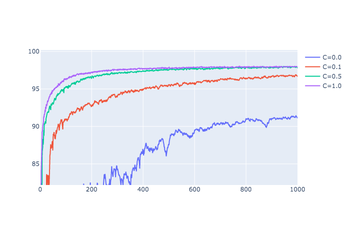
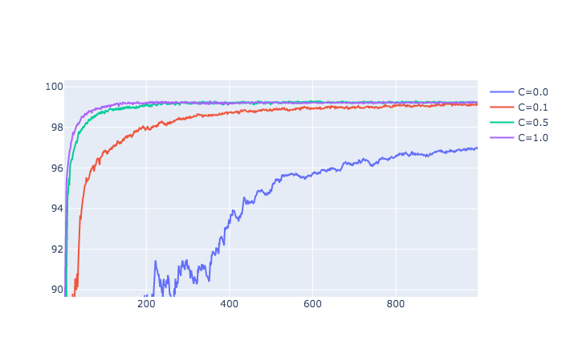

# fedavg.pytorch
A PyTorch implementation of "Communication-Efficient Learning of Deep Networks from Decentralized Data", AISTATS, 2017


## Performance

### MNIST


#### MLP(Non-IID), E=1

the number of rounds of communication necessary to achieve a test-set accuracy of 97%.

original used SGD, but our experiments used SGD with momentum(0.9) and weight decay(0.00001). And our max epoch is 1000.

| C    | B=inf(original) | B=inf(our)   | B=10(original) | B=10(our)    |
| ---- | --------------- | ------------ | -------------- | ------------ |
| 0.0  | 4278            | not prepared | 3275           | -            |
| 0.1  | 1796            | not prepared | 664            | -            |
| 0.2  | 1528            | not prepared | 619            | not prepared |
| 0.5  | -               | not prepared | 443            | 254          |
| 0.9  | -               | not prepared | 380            | 154          |



#### CNN(Non-IID), E=5

the number of rounds of communication necessary to achieve a test-set accuracy of 99%.

original used SGD, but our experiments used SGD with momentum(0.9) and weight decay(0.00001). And our max epoch is 1000.

| C    | B=inf(original) | B=inf(our)   | B=10(original) | B=10(our)    |
| ---- | --------------- | ------------ | -------------- | ------------ |
| 0.0  | 1181            | not prepared | 956            | -            |
| 0.1  | 1100            | not prepared | 206            | 580          |
| 0.2  | 978             | not prepared | 200            | not prepared |
| 0.5  | 1067            | not prepared | 261            | 146          |
| 0.9  | -               | not prepared | 97             | 93           |




## Installation

#### Requirements
- Python 3.6.8+
- Numpy
- Pytorch 1.4.0+
- torchvision
- hydra-core
- tensorboard

#### Docker Environment
```shell
# build docker image
$ docker build -t fedavg --build-arg UID=`id -u` -f docker/Dockerfile .
# create docker container and login bash
$ docker run -it -v `pwd`:/work --gpus all --name fedavg-container fedavg
docker@4d69df209f4a:/work$ python train.py --help
```

## Train
```shell
# example
$ python train.py n_round=100 C=0.3
```


## TODOs
- [x] GPU training
- [ ] MultiProcessing Training
- [ ] add FedSGD
- [ ] CIFAR-10 experiment
- [ ] write original peformance
- [ ] compare with original results 


## Paper
### Communication-Efficient Learning of Deep Networks from Decentralized Data
_Brendan McMahan, Eider Moore, Daniel Ramage, Seth Hampson,  Blaise Aguera y Arcas_ <br>

[[Paper]](https://arxiv.org/abs/1602.05629)

## Credit
```
@inproceedings{DBLP:conf/aistats/McMahanMRHA17,
  author    = {Brendan McMahan and
               Eider Moore and
               Daniel Ramage and
               Seth Hampson and
               Blaise Ag{\"{u}}era y Arcas},
  editor    = {Aarti Singh and
               Xiaojin (Jerry) Zhu},
  title     = {Communication-Efficient Learning of Deep Networks from Decentralized
               Data},
  booktitle = {Proceedings of the 20th International Conference on Artificial Intelligence
               and Statistics, {AISTATS} 2017, 20-22 April 2017, Fort Lauderdale,
               FL, {USA}},
  series    = {Proceedings of Machine Learning Research},
  volume    = {54},
  pages     = {1273--1282},
  publisher = {{PMLR}},
  year      = {2017},
  url       = {http://proceedings.mlr.press/v54/mcmahan17a.html},
  timestamp = {Wed, 29 May 2019 08:41:44 +0200},
  biburl    = {https://dblp.org/rec/conf/aistats/McMahanMRHA17.bib},
  bibsource = {dblp computer science bibliography, https://dblp.org}
}
```